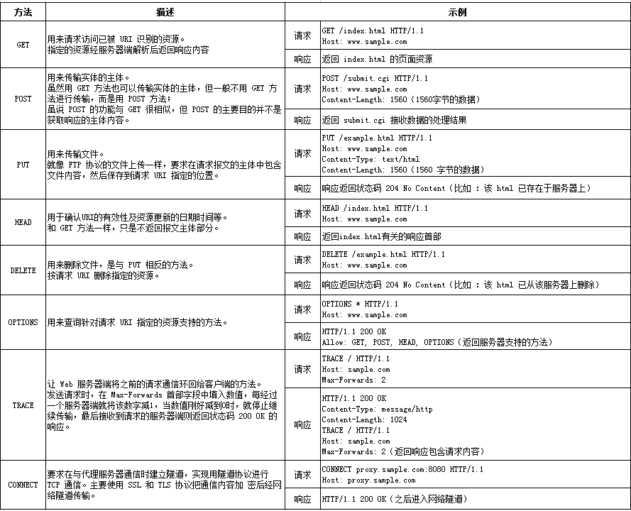
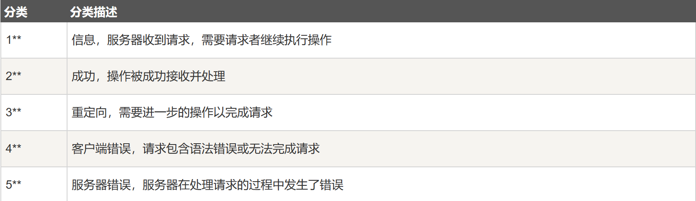

# 技能树
## web
### Http协议
- 请求方式：
- 状态码：
  - 对于重定向的情况，可以直接通过使用`curl`获得页面信息。
- Cookie欺骗、认证、伪造：
- 常用工具：
  - `curl` 
    - -v 选项，--verbose，指定该选项后，可以跟踪URL的连接信息。我们可以根据这个选项看看curl是怎么工作的。
    - -i 选项，--include，把回应的头信息包含在内，跟-v大同小异，是-v的子集。
    - -I （大写i）选项，--head，只显示返回的头信息，与-v大同小异，是-v的子集。
    - -u 选项，带用户验证的连接。可以访问或获取带用户验证的URL。
    ```cmd
    curl -u username:password ftp://127.0.0.1/hello.txt
    curl -u username ftp://127.0.0.1/hello.txt
    curl -u username:password https://127.0.0.1/
    ```
    - -d 选项，带请求参数的连接。比如下面的URL，user=xiaoruan&age=22就是所带的参数。crul可以带请求参数。http://127.0.0.1/index.html?user=xiaoruan&age=22
    ```cmd
    curl -d 'user=xiaoruan&age=22' http://127.0.0.1/index.html
    ```
    -  -X 选项，指定请求方式，我们只能URL可以有多种请求方式，最常见的是GET和POST，但请求的方式，包括GET、PUT、POST、DELETE四种方式。
    ```cmd
    curl -XGET www.baidu.com
    curl -XPOST www.baidu.com
    curl -XDELETE www.baidu.com
    curl -XPUT www.baidu.com
    ```
  - `burpsuit`
    - 爆破

