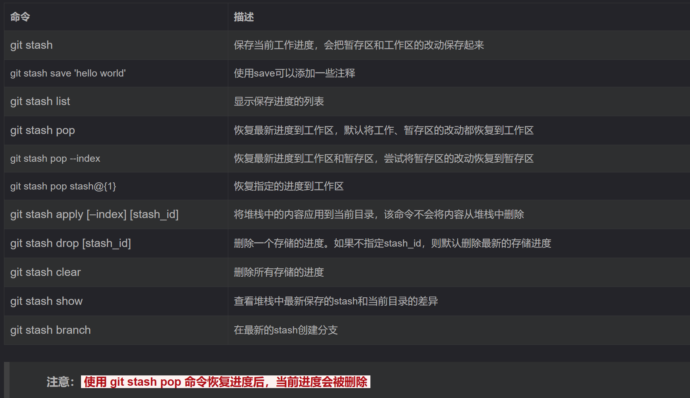

# 技能树
> 写在最前面，尽量在虚拟机里完成任务！！！
> 说的就是你们几个！！！
## web
### Http协议
- 请求方式：
- 状态码：
  - 对于重定向的情况，可以直接通过使用`curl`获得页面信息。
- Cookie欺骗、认证、伪造：
- 常用工具：
  - `curl` 
    - -v 选项，--verbose，指定该选项后，可以跟踪URL的连接信息。我们可以根据这个选项看看curl是怎么工作的。
    - -i 选项，--include，把回应的头信息包含在内，跟-v大同小异，是-v的子集。
    - -I （大写i）选项，--head，只显示返回的头信息，与-v大同小异，是-v的子集。
    - -u 选项，带用户验证的连接。可以访问或获取带用户验证的URL。
    ```cmd
    curl -u username:password ftp://127.0.0.1/hello.txt
    curl -u username ftp://127.0.0.1/hello.txt
    curl -u username:password https://127.0.0.1/
    ```
    - -d 选项，带请求参数的连接。比如下面的URL，user=xiaoruan&age=22就是所带的参数。crul可以带请求参数。http://127.0.0.1/index.html?user=xiaoruan&age=22
    ```cmd
    curl -d 'user=xiaoruan&age=22' http://127.0.0.1/index.html
    ```
    -  -X 选项，指定请求方式，我们只能URL可以有多种请求方式，最常见的是GET和POST，但请求的方式，包括GET、PUT、POST、DELETE四种方式。
    ```cmd
    curl -XGET www.baidu.com
    curl -XPOST www.baidu.com
    curl -XDELETE www.baidu.com
    curl -XPUT www.baidu.com
    ```
  - `burpsuit`
    - 爆破

### 信息泄露
#### 目录遍历
- 目录遍历是 Web 漏洞，该漏洞可以遍历服务器上的任意文件，可能包含用户数据、程序代码等敏感信息的泄露。漏洞原理主要是因为没有过滤用户输入的 ../ 相关的目录跳转符，使得攻击者通过目录跳转符来遍历服务器中的任意文件。
- (1)加密参数绕过：

        网站设计者可能会使用加密文件的方式对文件名加密上传到网站，访问网站时可能会显示 1.php?text=aW5kZXguaHRtbA== 这种以不安全的明文加密对网页文件加密，攻击者可以通过对网页文件解密进行绕过。

  (2)后缀过滤绕过：

        攻击者可以在文件目录上添加一些后缀名进行绕过。例一， ::$DATA 绕过，在文件名后加上如 1/3/::$DATA 系统会判断为文件流进行处理，并不检测文件后缀名。例二， %00 截断 ，在文件名后加上此截断如， 1/3.text%003.html 解析为 1/3.text 会自动忽略截断符号后的内容从而绕过。 

  (3)目录限定绕过：

        网站设计者可能使用限定目录权限对文件做分割，使用 ~ 符号可以对目录限定进行绕过，例如 1.php?text=~/1/3 可以直接跳转到对应的文件目录下。

- ```python
  # _*_ coding:utf-8 _*_
 
  import requests
 
  url = "http://challenge-88fe15103038d8b0.sandbox.ctfhub.com:10080/flag_in_here"
 
  for i in range(5):
      for j in range(5):
          url_final = url + "/" + str(i) + "/" + str(j)
          r = requests.get(url_final)
          r.encoding = "utf-8"
          get_file=r.text
          if "flag.txt" in get_file:
              print(url_final)
  ```

#### phpinfo
- phpinfo() 是 PHP 中的一个内置函数，主要用来显示配置的 PHP 信息。但是很多时候网站测试者因为没有及时删除配置信息页面，导致服务器信息泄露被不法分子利用渗透。 phpinfo() 函数可以查看 php 的所有信息，其中含有编译选项、扩充配置、版本和服务器信息、环境变量、操作系统版本信息、服务器路径、HTTP 标头等信息。

#### 网站源码
- 当开发人员在线上环境中对源代码进行了备份操作，并且将备份文件放在了 web 目录下，就会引起网站源码泄露。
- 使用脚本：
  ```python
  import requests
  url1 = 'url'
  # url为被扫描地址
  list1 = ['web', 'website', 'backup', 'back', 'www', 'wwwroot', 'temp']
  list2 = ['tar', 'tar.gz', 'zip', 'rar']
  for i in list1: 
      for j in list2: 
          back = str(i) + '.' + str(j)
          url = str(url1) + '/' + back
          print(back + '    ', end='')
          print(requests.get(url).status_code)
  ```
- 使用burpsuit爆破

#### bak文件
- bak 是一个 备份文件 ，为文件格式扩展名。这类文件一般在.bak前面加上应该有原来的扩展名比如windows.dll.bak，或是windows_dll.bak，有的则是由原文件的后缀名和bak混合而成。很多软件都会创建一个备份文件，当软件不小心因为删除或者机器意外关闭时，可以通过软件当时创建的备份文件继续编辑，为软件使用者减少了较大工作和损失。

#### vim
- 在使用vim时会创建临时缓存文件，关闭vim时缓存文件则会被删除，当vim异常退出后，因为未处理缓存文件，导致可以通过缓存文件恢复原始文件内容以 index.php 为例：第一次产生的交换文件名为 .index.php.swp，再次意外退出后，将会产生名为 .index.php.swo 的交换文件，第三次产生的交换文件则为 .index.php.swn
#### .DS_Store
- .DS_Store(英文全称 Desktop Services Store)是一种由苹果公司的Mac OS X操作系统所创造的隐藏文件，目的在于存贮目录的自定义属性，例如文件的图标位置或者是背景色的选择。相当于 Windows 下的 desktop.ini。

### SVN泄露与hg泄露等
- 这类源码泄漏通常是由于配置错误、误操作或不当的安全设置造成的。
  - 如svn泄露：“在使用SVN管理本地代码过程中，会自动生成一个名为.svn的隐藏文件夹，其中包含重要的源代码信息。但一些网站管理员在发布代码时，不愿意使用‘导出’功能，而是直接复制代码文件夹到WEB服务器上，这就使.svn隐藏文件夹被暴露于外网环境，黑客可以借助其中包含的用于版本信息追踪的‘entries’文件，逐步摸清站点结构。
  - 攻击者可以利用.svn/entries文件，获取到应用程序源代码、svn服务器账号密码等信息。同时，SVN产生的.svn目录下还包含了以.svn-base结尾的源代码文件副本（低版本SVN具体路径为text-base目录，高版本SVN为pristine目录），如果服务器没有对此类后缀做解析，黑客则可以直接获得文件源代码。
- 首先准备好`dirsearch`、`dvcs-ripper`工具
  - dirsearch可直接在Linux里面下载，dvcs-ripper需要从github上克隆到本地使用[dvcs-ripper下载](https://github.com/kost/dvcs-ripper/)
- 具体操作步骤：
  - 首先使用dirsearch扫描网站，查看是哪种泄露。
  - 再使用dvcs中对应的工具扫描。
> .txt.i文件通常是Mercurial使用的二进制文件，用于存储文件的内容和元数据，以便追踪文件的版本历史、支持分支管理等操作。这些文件的具体格式通常是Mercurial的内部实现细节，而不是一种通用的文件格式，因此用户不需要直接处理或编辑这些文件。


### git泄露
#### 工具
- [githack](https://github.com/BugScanTeam/GitHack)
- 无提示状态下，先试用dirsearch扫描一遍。
- `python2 GitHack.py http://www.example.com/.git/`(一定不要忘记.git)
#### 常见问题
- **log**
  - 通过查看log（`git log`）,对比不同版本提交记录（`git diff 版本号`）。
- **stash**
  - 

### 密码口令
- 弱密码：爆破（burpsuit）
- 默认密码